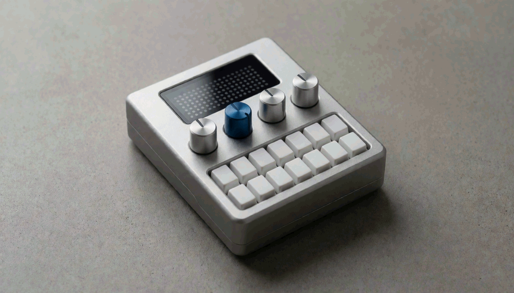

# pulsar

a web synthesizer with a register-accurate NES 2A03 APU as its voice, plus the
VRC6 cartridge expansion's two pulses and sawtooth — eight voices in all —
band-limited synthesis in an AudioWorklet, played live from your keyboard or
MIDI, growing into a FamiTracker-compatible tracker. The face is the Ivory
design: a pale mineral slab, three voice dials, an output slider, one deep
green dot-matrix screen and a two-octave keybed, with the tracker as a second
workspace behind one switch (`docs/ivory-gui.md`).



> concept render. generated locally with Krea 2 Turbo (seed 810, 8 steps, cfg 1, 1344×768).
> the krea-2-community-license applies to this image — see [ASSETS.md](ASSETS.md). **pulsar is
> not a teenage engineering product and is not affiliated with them.**

## status

phases 1–2 complete: the 2A03 core (2 pulse, triangle, noise, DPCM) and the
VRC6 expansion (2 pulse + sawtooth) — eight voices, eight tracker lanes — live
play with touch, QWERTY or Web MIDI, and a tracker with original preset songs.
The app also runs inside alexvoigt.com; see
[homepage integration](docs/homepage-integration.md) for build and browser checks.
Later phases cover the WAV export UI, further expansion chips and text interchange.

## original soundtrack

Three original NES/Famicom compositions ship as the presets: **Skyline Run** (an
action-stage theme, 150 BPM, 2A03 with DPCM kick and snare), **Cathedral of Gears** (a
gothic theme, 150 BPM) and **Tide Tables** (a slow ambient piece in 5/4, 56 BPM). They
are the demo pieces of OCTET, a sibling 2A03 + VRC6 sequencer project, converted here
by the modules in `tools/songs/octet/`: Skyline Run is a five-lane 2A03 song, while
Cathedral of Gears and Tide Tables also carry the VRC6's two extra pulses and its
sawtooth — eight lanes. Choose them in the transport row's **Song**
picker. All notes and instruments are editable. `pnpm preview:songs` renders
unnormalized WAVs, including a second pass through each loop, into `previews/`. See
the [track notes and audition guide](docs/soundtrack.md).

## run

```bash
pnpm install
pnpm dev        # http://localhost:5173 — served cross-origin-isolated
pnpm test       # vitest: DSP, mixer, pitch, aliasing suites
pnpm typecheck  # five isolated TS projects + svelte-check
pnpm build && pnpm preview
```

chrome/edge are the primary MIDI targets. browsers without Web MIDI retain
on-screen touch/pointer keys and computer keyboard input. compact screens get
the instrument workspace and the song transport; wider screens can switch to
the tracker workspace.

## architecture in one breath

everything is a stream of `(nes_cycle, register, value)` writes — live keys,
the future tracker, and WAV export all produce the same stream, and one
worklet-hosted APU core consumes it (`docs/register-timeline.md`). the core
clocks channels at 1.789773 MHz and downsamples through a fresh implementation
of band-limited step synthesis. deliberate divergences from hardware are
ledgered in `docs/deviations.md`.

## licensing

MIT (see `LICENSE`). the APU and DSP are original implementations written
against public NESdev documentation — no GPL/LGPL emulator source was consulted
(`NOTICE.md`). generated images carry their own model licenses, documented
per-file in `ASSETS.md`.

pulsar is not a teenage engineering product and is not affiliated with them.
